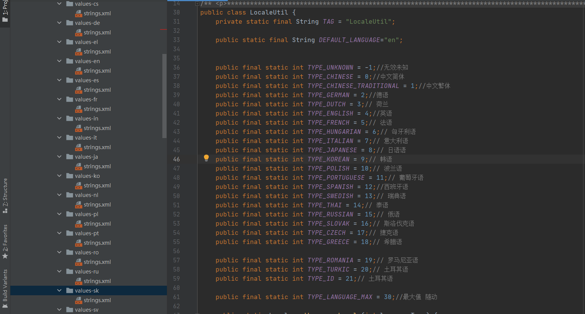
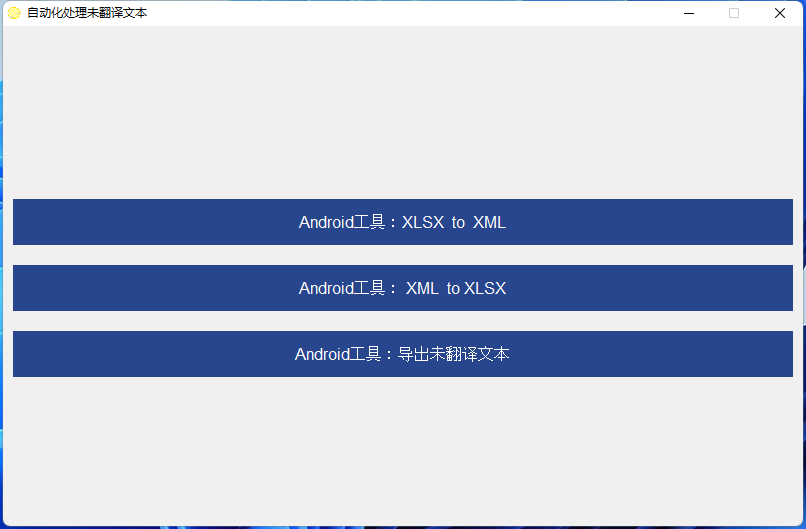

# Android多语言导出/导入工具它来了

[点击下载工具](./exe/LanguageMaster4.0.exe)

在Android项目中，有没有遇到多语言涉及十几个国家的语言需要翻译，管理，又或者是翻译总是在不断更新迭代，就比如我负责的一个项目，多语言如下：

看到这么多语言，全部由人工去完成，这显然是一项噩梦级别的体力活，那么如何**一键导出**生成`Excel`让人帮忙翻译, 待翻译回来之后，又该如何**一键导入**将`Excel`文件生成`Android res` 目录下`xml`文件呢，今天这款工具它来啦！！！

工具支持如下：

- 支持**一键导出**将所有`values-xx/strings.xml`文件生成在一个`Excel`.

- 支持**一键导入**将Excel文件导入到Android工程生成所有对应语言`strings.xml`文件.

- 支持**一键导出**未翻译Android语言资源.

## 最后

​		本工程通过编写python代码完成这些功能，通过`pyinstaller`打包生成的exe文件。因为功能简单，又挺实用的，开源出来供大家使用。
